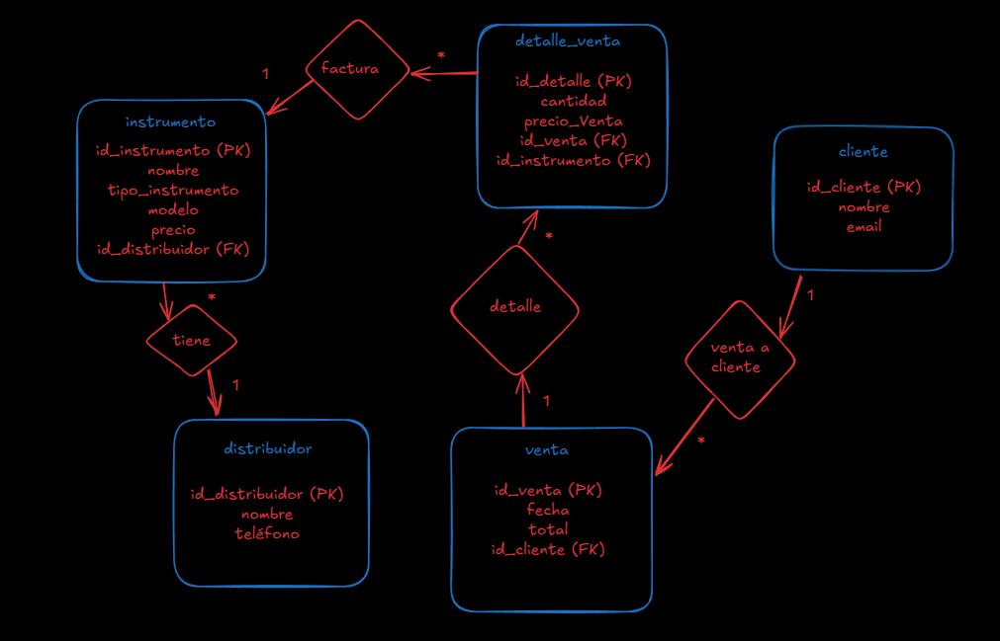
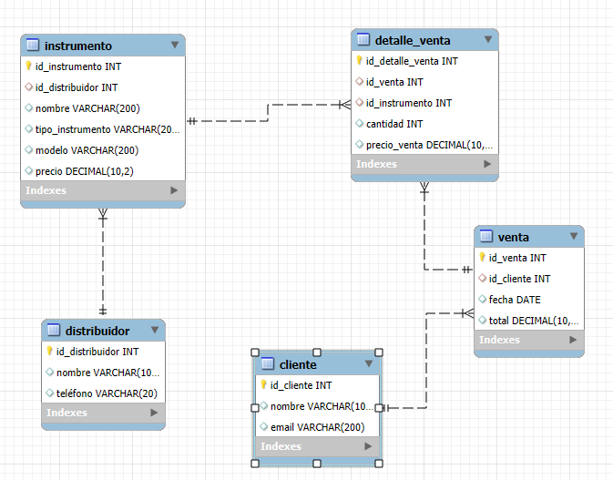

# PRIMER DER ONTOLOGICO DE TIENDA DE INSTRUMENTOS

# DIAGRAMA RELACIONES WORKBENCH

## 1. Tablas

### 1.1. Tabla `distribuidor`
- **Descripción:** Almacena información sobre los distribuidores de instrumentos.
- **Columnas:**
  - `id_distribuidor`: INT, clave primaria, autoincremental.
  - `nombre`: VARCHAR(100), nombre del distribuidor.
  - `teléfono`: VARCHAR(20), número de teléfono del distribuidor.

### 1.2. Tabla `instrumento`
- **Descripción:** Contiene los detalles de los instrumentos disponibles para la venta.
- **Columnas:**
  - `id_instrumento`: INT, clave primaria, autoincremental.
  - `id_distribuidor`: INT, clave foránea (FK) que referencia a `distribuidor(id_distribuidor)`.
  - `nombre`: VARCHAR(200), nombre del instrumento.
  - `tipo_instrumento`: VARCHAR(200), tipo de instrumento (ej. guitarra, piano).
  - `modelo`: VARCHAR(200), modelo del instrumento.
  - `precio`: DECIMAL(10,2), precio del instrumento.

### 1.3. Tabla `cliente`
- **Descripción:** Registra la información de los clientes.
- **Columnas:**
  - `id_cliente`: INT, clave primaria, autoincremental.
  - `nombre`: VARCHAR(100), nombre del cliente.
  - `email`: VARCHAR(200), correo electrónico del cliente.

### 1.4. Tabla `venta`
- **Descripción:** Registra las ventas realizadas a los clientes.
- **Columnas:**
  - `id_venta`: INT, clave primaria, autoincremental.
  - `id_cliente`: INT, clave foránea (FK) que referencia a `cliente(id_cliente)`.
  - `fecha`: DATE, fecha de la venta.
  - `total`: DECIMAL(10,2), total de la venta.

### 1.5. Tabla `detalle_venta`
- **Descripción:** Detalla los instrumentos vendidos en cada transacción.
- **Columnas:**
  - `id_detalle_venta`: INT, clave primaria, autoincremental.
  - `id_venta`: INT, clave foránea (FK) que referencia a `venta(id_venta)`.
  - `id_instrumento`: INT, clave foránea (FK) que referencia a `instrumento(id_instrumento)`.
  - `cantidad`: INT, cantidad del instrumento vendido.
  - `precio_venta`: DECIMAL(10,2), precio de venta del instrumento en la transacción.

## 2. Relaciones entre Tablas

- **Distribuidor ↔ Instrumento**
  - Un distribuidor puede tener múltiples instrumentos.
  - Relación: Uno a Muchos.
  - Clave foránea: `instrumento.id_distribuidor` referencia a `distribuidor.id_distribuidor`.

- **Cliente ↔ Venta**
  - Un cliente puede realizar múltiples ventas.
  - Relación: Uno a Muchos.
  - Clave foránea: `venta.id_cliente` referencia a `cliente.id_cliente`.

- **Venta ↔ Detalle Venta**
  - Una venta puede tener múltiples detalles (instrumentos vendidos).
  - Relación: Uno a Muchos.
  - Clave foránea: `detalle_venta.id_venta` referencia a `venta.id_venta`.

- **Instrumento ↔ Detalle Venta**
  - Un instrumento puede aparecer en múltiples detalles de venta.
  - Relación: Uno a Muchos.
  - Clave foránea: `detalle_venta.id_instrumento` referencia a `instrumento.id_instrumento`.

Esta estructura permite gestionar de manera eficiente la información sobre distribuidores, clientes, instrumentos, ventas y detalles de cada venta en el sistema de venta de instrumentos.